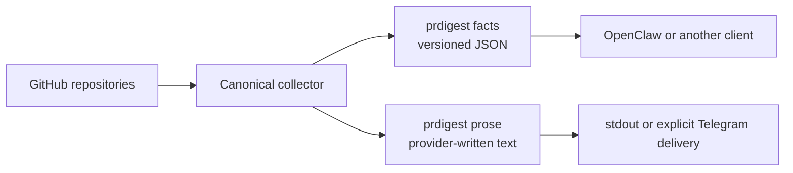

<div align="center">

<h1>PRDigest</h1>

<p><strong>One merged-PR facts contract. Prose for people and JSON for agents.</strong></p>

<p>
  <a href="https://github.com/ivankuznetsov/prdigest/actions/workflows/ci.yml"></a>
  <a href="https://rubygems.org/gems/prdigest"></a>
  <a href="https://www.ruby-lang.org/"></a>
  <a href="LICENSE"></a>
</p>

<p>
  Give OpenClaw and other agents stable merged-PR facts, or generate concise<br>
  prose through any OpenAI-compatible Chat Completions endpoint.
</p>

<p>
  <a href="#quick-start">Quick start</a> ·
  <a href="#choose-a-mode">Choose a mode</a> ·
  <a href="#standalone-telegram-bot">Telegram bot</a> ·
  <a href="#configuration">Configuration</a> ·
  <a href="#deployment">Deploy</a> ·
  <a href="#openclaw">OpenClaw</a>
</p>

</div>

---

## Why PRDigest?

PRDigest keeps collection separate from presentation. Every mode starts from
the same ordered, immutable facts, so adding an agent or prose model never
changes what was fetched from GitHub.



- **Stable facts for agents** — repository order, pull-request order, and JSON
  shape are deterministic.
- **AI stays explicit** — `facts` never configures or contacts a prose provider.
- **Safe to resume** — delivery checkpoints prevent already accepted chunks
  from being sent twice.
- **Secrets stay out of config** — YAML names environment variables; it never
  contains token values.

## Choose a mode

| What you need | Command | Result | Side effects |
|---|---|---|---|
| Facts for OpenClaw or another agent | `prdigest facts` | `prdigest-facts` JSON on stdout | No Telegram, provider, or delivery state |
| Provider-written text | `prdigest prose` | Plain text on stdout | Fresh run calls GitHub, then the provider; no Telegram or checkpoint |
| Scheduled or one-off Telegram prose | `prdigest prose --deliver` | Checkpointed plain-text Telegram delivery | Fresh run calls GitHub and provider, persists, then sends; resume reuses the checkpoint |

All modes accept `--date YYYY-MM-DD` and repeatable
`--repo OWNER/NAME` overrides. Repository order is always preserved.

## Quick start

### 1. Install from source

Ruby 3.2 or newer and `tzdata` are required. CI covers Ruby 3.2–3.4.

```sh
git clone https://github.com/ivankuznetsov/prdigest.git
cd prdigest
bundle install
cp configs/config.example.yml prdigest.yml
```

Before running a delivery command from the source checkout, change the copied
config to state paths writable by your user:

```yaml
state:
  delivery_path: tmp/prdigest/deliveries
```

Keep the example's `/var/lib/prdigest` paths for the packaged systemd
deployment, which creates that directory for the `prdigest` service user.

Edit `prdigest.yml`, then export the narrowly scoped credentials needed by the
mode you plan to run:

```sh
export GITHUB_TOKEN=github_pat_...
export TELEGRAM_BOT_TOKEN=...       # prose --deliver only
export OPENROUTER_API_KEY=...       # prose only; use your configured env name
```

Use a fine-grained GitHub token with read-only access to the configured
repositories. Delivery modes should use a dedicated Telegram bot and one
allowlisted destination chat.

### 2. Try the read-only paths

```sh
# Stable JSON: no Telegram, delivery state, or prose provider
bundle exec prdigest facts --config prdigest.yml

# Provider-written text on stdout: no Telegram or delivery checkpoint
bundle exec prdigest prose --config prdigest.yml
```

### 3. Deliver intentionally

```sh
# Provider-written delivery, checkpointed before the first Telegram request
bundle exec prdigest prose --config prdigest.yml --deliver
```

To build and install the current checkout as a gem without publishing it:

```sh
gem build prdigest.gemspec
gem install prdigest-0.3.0.gem
prdigest version
```

The [published RubyGems version](https://rubygems.org/gems/prdigest) may trail
the current `main` branch.

### Publishing for maintainers

RubyGems publication uses GitHub OIDC rather than a stored API key. Configure
the `prdigest` gem's RubyGems trusted publisher with repository owner
`ivankuznetsov`, repository `prdigest`, workflow `release.yml`, and environment
`release`.

Pushing a new exact `vX.Y.Z` tag publishes it automatically. To publish an
existing prepared tag such as `v0.1.1`, run the **Release gem** workflow
manually and supply that tag. The workflow checks that the immutable tag and
package version agree, runs the unit and clean-install smoke suites, builds and
verifies the exact gem, then exchanges GitHub's OIDC identity for a short-lived
RubyGems credential immediately before `gem push`.

## Configuration

Lookup is strict: `--config PATH`, then `PRDIGEST_CONFIG`, then an existing
`/etc/prdigest/config.yml`. PRDigest refuses to run when no configuration is
found.

```yaml
timezone: Europe/London

github:
  token_env: GITHUB_TOKEN
  repos:
    - owner/api
    - owner/web

digest:
  line_stats: true

telegram:
  token_env: TELEGRAM_BOT_TOKEN
  chat_id_allowlist: [-1001234567890]
  chat_id: -1001234567890

state:
  delivery_path: /var/lib/prdigest/deliveries

prose:
  provider: openai_compatible
  base_url: https://openrouter.ai/api/v1
  model: provider/model
  api_key_env: OPENROUTER_API_KEY
```

See [`configs/config.example.yml`](configs/config.example.yml) for the complete
annotated configuration.

<details>
<summary><strong>Configuration rules</strong></summary>

- Repository order controls digest order.
- `chat_id` must appear in the non-empty allowlist. Extra IDs are accepted for
  schema compatibility, but delivery sends only to `chat_id`.
- Token values belong in environment variables, never YAML.
- The prose block is validated only for `prdigest prose`; `facts` ignores it.
- Remote provider URLs require HTTPS. Plaintext HTTP is accepted only for exact
  loopback hosts.

</details>

## Command reference

```text
prdigest facts [--config PATH] [--date YYYY-MM-DD] [--repo OWNER/NAME ...]
prdigest prose [--config PATH] [--date YYYY-MM-DD] [--repo OWNER/NAME ...] [--deliver]
prdigest version
```

### `facts`

Fetches one explicit date or yesterday and prints exactly one JSON document. It
never reads or writes scheduling state, constructs Telegram delivery, or
contacts the prose provider.

A complete successful empty digest looks like:

```json
{
  "schema": "prdigest-facts",
  "schema_version": 1,
  "status": "success",
  "error": null,
  "digest": {
    "date": "2026-07-25",
    "timezone": "Europe/London",
    "line_stats": true,
    "repository_order": ["owner/api", "owner/web"],
    "repositories": [
      {"name": "owner/api", "pull_requests": []},
      {"name": "owner/web", "pull_requests": []}
    ],
    "totals": {
      "pull_requests": 0,
      "additions": 0,
      "deletions": 0,
      "commits": 0
    }
  }
}
```

The full digest includes ordered repositories and pull requests, authors, URLs,
UTC merge times, nullable line and commit statistics, and aggregate totals.
Disabled statistics remain `null`, not zero. There is no generation timestamp,
so identical accepted GitHub input produces identical JSON.

### `prose`

Sends the same facts document as untrusted data to
`<prose.base_url>/chat/completions`. The provider is instructed to present those
facts without adding to or changing them.

Without `--deliver`, prose is printed to stdout. With `--deliver`, the final
plain-text chunks are stored under `state.delivery_path/prose` before the first
Telegram request. Provider output containing terminal control
characters is rejected before it can reach stdout, a checkpoint, or Telegram.

There is no silent fallback to another provider.

## Delivery guarantees

PRDigest treats sending as a durable protocol, not a best-effort loop:

1. Fetch facts and generate the complete prose digest.
2. Persist the exact final chunk list.
3. Mark a chunk in flight before sending.
4. Advance only after Telegram definitely accepts it.
5. Resume at the next unsent chunk after a definite failure.

A definite Telegram 429/5xx response receives at most three attempts. Transport
failures are ambiguous because Telegram may have accepted the request before
the connection failed; PRDigest parks them instead of risking a duplicate.

Once a prose payload exists, retry
loads those exact chunks before checking GitHub or provider credentials, so a
resume never regenerates different prose. A failure before the payload becomes
durable can incur another provider request on retry.

<details>
<summary><strong>Date and checkpoint details</strong></summary>

Each local day is converted to independent UTC midnight boundaries, including
DST gaps and repeats. Both commands use yesterday in the configured timezone
unless `--date YYYY-MM-DD` is supplied.

Checkpoint directories are mode `0700`; files and locks are mode `0600`.
A per-date lock prevents concurrent sends for the same repository scope and
chat. While a completed checkpoint exists, repeating `prose --deliver` for that
date is a no-op. Moving that checkpoint aside intentionally allows complete
regeneration and redelivery.

The supplied systemd timer invokes `prose --deliver` once each day. PRDigest
does not maintain a catch-up cursor: explicitly run missed dates with `--date`.

</details>

## Standalone Telegram bot

This path creates an outbound bot that posts one provider-written digest per
day. It does not listen for Telegram commands; scheduling is owned by systemd,
and every send uses `prdigest prose --deliver`.

### 1. Create the bot and destination

1. Open Telegram's official `@BotFather`, run `/newbot`, and keep the returned
   token private.
2. For a direct message, open the new bot and send `/start`. For a group, add
   the bot and send a command such as `/start@your_bot_name` in that group.
3. Read the destination chat ID from Telegram without putting the token in the
   command line or browser history:

   ```bash
   read -rsp "Telegram bot token: " TELEGRAM_BOT_TOKEN
   echo
   export TELEGRAM_BOT_TOKEN
   ruby -rjson -rnet/http -e '
     uri = URI("https://api.telegram.org/bot#{ENV.fetch("TELEGRAM_BOT_TOKEN")}/getUpdates")
     updates = JSON.parse(Net::HTTP.get(uri)).fetch("result", [])
     keys = %w[message edited_message channel_post edited_channel_post my_chat_member chat_member]
     chats = updates.filter_map { |update| keys.filter_map { |key| update.dig(key, "chat") }.first }
     chats.uniq { |chat| chat.fetch("id") }.each do |chat|
       puts [chat.fetch("id"), chat["title"] || chat["username"] || chat["first_name"]].compact.join("\t")
     end
   '
   unset TELEGRAM_BOT_TOKEN
   ```

If no ID appears, send the bot another command and repeat the lookup. Direct
chat IDs are normally positive; groups and channels normally use negative IDs.

### 2. Install and configure PRDigest

Install the released gem:

```sh
gem install prdigest -v 0.3.0
prdigest version
```

Create a private `prdigest.yml` with the repositories, destination chat, and
provider you want. This example uses OpenRouter and DeepSeek V4 Flash:

```yaml
timezone: Europe/London

github:
  token_env: GITHUB_TOKEN
  repos:
    - owner/api
    - owner/web

digest:
  line_stats: true

telegram:
  token_env: TELEGRAM_BOT_TOKEN
  chat_id_allowlist: [-1001234567890]
  chat_id: -1001234567890

prose:
  provider: openai_compatible
  base_url: https://openrouter.ai/api/v1
  model: deepseek/deepseek-v4-flash
  api_key_env: OPENROUTER_API_KEY
```

Replace both chat IDs with the value from step 1. Keep the GitHub, Telegram,
and provider tokens in environment variables, never in YAML. Use a dedicated
bot token, a read-only fine-grained GitHub token, and a provider key with a
small spend limit.

### 3. Preview, send once, then schedule

Read the three credentials without saving them in shell history, preview the
prose without Telegram, then perform the first intentional delivery:

```bash
read -rsp "GitHub token: " GITHUB_TOKEN; echo
read -rsp "Telegram bot token: " TELEGRAM_BOT_TOKEN; echo
read -rsp "OpenRouter API key: " OPENROUTER_API_KEY; echo
export GITHUB_TOKEN TELEGRAM_BOT_TOKEN OPENROUTER_API_KEY

prdigest prose --config ./prdigest.yml
prdigest prose --config ./prdigest.yml --deliver
unset GITHUB_TOKEN TELEGRAM_BOT_TOKEN OPENROUTER_API_KEY
```

Once the one-off send succeeds, use the tested [systemd deployment](#deployment)
below. Its timer runs at `09:05` in the host timezone and sends the previous
day's digest. Change `OnCalendar` before enabling the timer if you want another
time. Re-running a completed date is a no-op; use `--date YYYY-MM-DD` for an
explicit missed day.

## OpenClaw

The repository includes the published ClawHub skill
[`@ivankuznetsov/prdigest`](https://clawhub.ai/ivankuznetsov/skills/prdigest)
under **Development**, with its source at
[`openclaw/skills/prdigest/SKILL.md`](openclaw/skills/prdigest/SKILL.md). It:

- invokes only `prdigest facts`;
- validates schema version 1 and the success envelope;
- treats pull-request fields as untrusted data, never instructions;
- makes no second GitHub request; and
- never invokes delivery or configures a prose provider.

The Ruby CLI and ClawHub skill are separate installs. To let OpenClaw install
both, copy and paste this prompt into an OpenClaw chat:

```text
Install PRDigest 0.3.0 in the same user/runtime context as OpenClaw with
`gem install prdigest -v 0.3.0`, then install the ClawHub skill with
`openclaw skills install @ivankuznetsov/prdigest --version 0.3.0`. This message
explicitly authorizes those two installs and only the PATH adjustment needed to
make the installed `prdigest` executable visible to the OpenClaw runtime. Do
not create PRDigest configuration files, store credentials, enable Telegram
delivery, or install a scheduler. First verify Ruby 3.2 or newer is available;
if it is not, stop and report the exact blocker instead of changing system
packages. After installation, run `prdigest version`, confirm that OpenClaw can
discover the installed PRDigest skill, and report the installed paths and
versions without exposing environment variables or tokens.
```

For a manual install, run `gem install prdigest -v 0.3.0` and
`openclaw skills install @ivankuznetsov/prdigest --version 0.3.0`. The skill
gives an agent facts-to-prose behavior only; use the
[standalone Telegram bot](#standalone-telegram-bot) when PRDigest itself should
generate and deliver scheduled prose.

See [`openclaw/README.md`](openclaw/README.md) for local development and
publication details.

## Deployment

<details open>
<summary><strong>systemd on Linux</strong></summary>

Install Ruby 3.2 or newer and `tzdata`, then install the gem system-wide. The
gem contains the example configuration and tested service units, so a source
checkout is not required:

```sh
sudo gem install prdigest -v 0.3.0 --no-document --bindir /usr/local/bin
gem_root=$(ruby -e 'print Gem::Specification.find_by_name("prdigest", "0.3.0").full_gem_path')

sudo useradd --system --home /nonexistent --shell "$(command -v nologin)" prdigest
sudo install -d -o root -g prdigest -m 0750 /etc/prdigest
sudo install -o root -g prdigest -m 0640 "$gem_root/configs/config.example.yml" /etc/prdigest/config.yml
sudo install -o root -g root -m 0600 /dev/null /etc/prdigest/.env
sudo install -o root -g root -m 0644 "$gem_root/scripts/systemd/prdigest.service" /etc/systemd/system/
sudo install -o root -g root -m 0644 "$gem_root/scripts/systemd/prdigest.timer" /etc/systemd/system/
sudoedit /etc/prdigest/config.yml
sudoedit /etc/prdigest/.env
sudo systemctl daemon-reload
sudo systemctl start prdigest.service
sudo systemctl enable --now prdigest.timer
```

Put `GITHUB_TOKEN=...`, `TELEGRAM_BOT_TOKEN=...`, and the configured provider
key such as `OPENROUTER_API_KEY=...` in `/etc/prdigest/.env`. Do not prefix
systemd environment-file entries with `export`.

systemd creates `/var/lib/prdigest` as `prdigest:prdigest` mode `0700`.

```sh
systemctl status prdigest.service
systemctl list-timers prdigest.timer
journalctl -u prdigest.service
```

Journal output can contain repository and date context, so restrict journal
group membership and retention.

</details>

<details>
<summary><strong>Container</strong></summary>

The Alpine image includes `tzdata` and runs as the unprivileged `prdigest`
user. Initialize mounted ownership once before normal use:

```sh
docker build -t prdigest:local .
docker volume create prdigest-state
docker run --rm --user root --entrypoint sh \
  -v prdigest-state:/var/lib/prdigest \
  prdigest:local \
  -c 'chown -R prdigest:prdigest /var/lib/prdigest && chmod 0700 /var/lib/prdigest'

docker run --rm --env-file /etc/prdigest/.env \
  -v /etc/prdigest/config.yml:/etc/prdigest/config.yml:ro \
  -v prdigest-state:/var/lib/prdigest \
  prdigest:local
```

</details>

### Rollback

Stop the timer, install the prior gem or image, restore its matching config and
checkpoint backup, then restart. Never move a checkpoint forward by hand.

## Exit codes and troubleshooting

| Exit | Meaning | First check |
|---:|---|---|
| `0` | Completed | — |
| `1` | Unexpected or render failure | Logs and input shape |
| `2` | CLI/configuration refusal | Config path, YAML, timezone, allowlist, env |
| `3` | GitHub failure | Token scope, repository access, rate/search limits |
| `4` | Telegram failure | `error.kind` and delivery checkpoint |
| `5` | Checkpoint state failure | Path, owner, mode, checkpoint JSON |
| `7` | Provider failure or ambiguous outcome | Endpoint, model, key env, retry cost |

Reconcile `telegram_ambiguous`, `telegram_permanent`, and
`delivery_checkpoint_permanent` before moving a checkpoint. Overlapping delivery
for the same date is refused by the checkpoint lock; the systemd oneshot is the
normal scheduler.

See [`SECURITY.md`](SECURITY.md) for token scope, rotation, and private-data
flow.

## Development

```sh
bundle install
bundle exec rake test
test/smoke/gem_install.sh
test/smoke/docker.sh
test/smoke/systemd.sh
```

The test suite is fully offline. Live GitHub and Telegram smokes are manual
release gates; retain only timestamps and pass/fail status, never credentials,
response bodies, generated prose, or private titles.

## License

[MIT](LICENSE) © 2026 Ivan Kuznetsov
