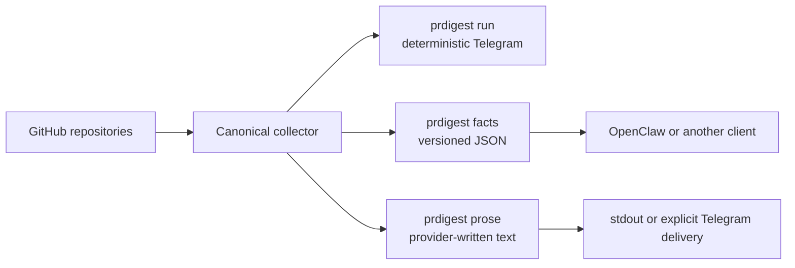

<div align="center">

<h1>PRDigest</h1>

<p><strong>One source of truth for merged pull requests. Three ways to present it.</strong></p>

<p>
  <a href="https://github.com/ivankuznetsov/prdigest/actions/workflows/ci.yml"></a>
  <a href="https://rubygems.org/gems/prdigest"></a>
  <a href="https://www.ruby-lang.org/"></a>
  <a href="LICENSE"></a>
</p>

<p>
  Collect merged PRs once, then deliver a deterministic Telegram digest, emit<br>
  stable JSON for an agent, or generate optional prose through an
  OpenAI-compatible Chat Completions endpoint.
</p>

<p>
  <a href="#quick-start">Quick start</a> ·
  <a href="#choose-a-mode">Choose a mode</a> ·
  <a href="#configuration">Configuration</a> ·
  <a href="#deployment">Deploy</a> ·
  <a href="#openclaw">OpenClaw</a>
</p>

</div>

---

## Why PRDigest?

PRDigest keeps collection separate from presentation. Every mode starts from
the same ordered, immutable facts, so adding an agent or prose model never
changes what was fetched from GitHub.



- **Deterministic by default** — repository order, pull-request order, and JSON
  shape are stable.
- **AI stays optional** — neither `run` nor `facts` configures or contacts a
  prose provider.
- **Safe to resume** — delivery checkpoints prevent already accepted chunks
  from being sent twice.
- **Secrets stay out of config** — YAML names environment variables; it never
  contains token values.

## Choose a mode

| What you need | Command | Result | Side effects |
|---|---|---|---|
| Reliable scheduled digest | `prdigest run` | Deterministic Telegram HTML | Reads/writes schedule and delivery state |
| Facts for OpenClaw or another client | `prdigest facts` | `prdigest-facts` JSON on stdout | No schedule state, Telegram, or AI provider |
| Provider-written text | `prdigest prose` | Plain text on stdout | Fresh run calls GitHub, then the provider; no Telegram or checkpoint |
| Provider-written Telegram digest | `prdigest prose --deliver` | Checkpointed Telegram delivery | Fresh run calls GitHub and provider, persists, then sends; resume uses the checkpoint without GitHub/provider generation |

All modes accept `--date YYYY-MM-DD` and repeatable
`--repo OWNER/NAME` overrides. Repository order is always preserved.

## Quick start

### 1. Install from source

Ruby 3.2 or newer and `tzdata` are required. CI covers Ruby 3.2–3.4.

```sh
git clone https://github.com/ivankuznetsov/prdigest.git
cd prdigest
bundle install
cp configs/config.example.yml prdigest.yml
```

Before running a delivery command from the source checkout, change the copied
config to state paths writable by your user:

```yaml
state:
  path: tmp/prdigest/state.json
  delivery_path: tmp/prdigest/deliveries
```

Keep the example's `/var/lib/prdigest` paths for the packaged systemd
deployment, which creates that directory for the `prdigest` service user.

Edit `prdigest.yml`, then export the narrowly scoped credentials needed by the
mode you plan to run:

```sh
export GITHUB_TOKEN=github_pat_...
export TELEGRAM_BOT_TOKEN=...       # run or prose --deliver only
export OPENROUTER_API_KEY=...       # prose only; use your configured env name
```

Use a fine-grained GitHub token with read-only access to the configured
repositories. Delivery modes should use a dedicated Telegram bot and one
allowlisted destination chat.

### 2. Try the read-only paths

```sh
# Stable JSON: no scheduler state, Telegram, or prose provider
bundle exec prdigest facts --config prdigest.yml

# Deterministic Telegram preview: fetches GitHub but does not send or save state
bundle exec prdigest run --config prdigest.yml --dry-run

# Provider-written text on stdout: no Telegram or delivery checkpoint
bundle exec prdigest prose --config prdigest.yml
```

### 3. Deliver intentionally

```sh
# Scheduled deterministic delivery
bundle exec prdigest run --config prdigest.yml

# Provider-written delivery, checkpointed before the first Telegram request
bundle exec prdigest prose --config prdigest.yml --deliver
```

To build and install the current checkout as a gem without publishing it:

```sh
gem build prdigest.gemspec
gem install prdigest-0.2.0.gem
prdigest version
```

The [published RubyGems version](https://rubygems.org/gems/prdigest) may trail
the current `main` branch.

## Configuration

Lookup is strict: `--config PATH`, then `PRDIGEST_CONFIG`, then an existing
`/etc/prdigest/config.yml`. PRDigest refuses to run when no configuration is
found.

```yaml
timezone: Europe/London

github:
  token_env: GITHUB_TOKEN
  repos:
    - owner/api
    - owner/web

schedule:
  max_catchup_days: 7

digest:
  line_stats: true
  send_empty: true
  empty_message: "Merged PR digest — {date}\nTotal: 0 PRs"

telegram:
  token_env: TELEGRAM_BOT_TOKEN
  chat_id_allowlist: [-1001234567890]
  chat_id: -1001234567890

state:
  path: /var/lib/prdigest/state.json
  delivery_path: /var/lib/prdigest/deliveries

prose:
  provider: openai_compatible
  base_url: https://openrouter.ai/api/v1
  model: provider/model
  api_key_env: OPENROUTER_API_KEY
```

See [`configs/config.example.yml`](configs/config.example.yml) for the complete
annotated configuration.

<details>
<summary><strong>Configuration rules</strong></summary>

- Repository order controls digest order.
- `max_catchup_days` must be between `1` and `30`.
- `chat_id` must appear in the non-empty allowlist. Extra IDs are accepted for
  schema compatibility, but delivery sends only to `chat_id`.
- Token values belong in environment variables, never YAML.
- The prose block is validated only for `prdigest prose`; it does not ambiently
  enable provider access for deterministic commands.
- Remote provider URLs require HTTPS. Plaintext HTTP is accepted only for exact
  loopback hosts.

</details>

## Command reference

```text
prdigest run [--config PATH] [--date YYYY-MM-DD] [--dry-run] [--json] [--repo OWNER/NAME ...]
prdigest facts [--config PATH] [--date YYYY-MM-DD] [--repo OWNER/NAME ...]
prdigest prose [--config PATH] [--date YYYY-MM-DD] [--repo OWNER/NAME ...] [--deliver]
prdigest serve
prdigest version
```

### `run`

An ordinary run processes owed dates oldest-first and advances state after each
settled day. `--date` replays exactly one local date without reading or writing
the schedule cursor. `--dry-run` previews an explicit date or yesterday and
constructs neither state nor Telegram delivery.

`--json` emits a versioned `prdigest-result` document with requested, settled,
skipped, failed, and remaining dates plus delivery progress. `serve` is a
compatibility stub; use the supplied systemd timer for scheduling.

### `facts`

Fetches one explicit date or yesterday and prints exactly one JSON document. It
never reads or writes scheduling state, constructs Telegram delivery, or
contacts the prose provider.

A complete successful empty digest looks like:

```json
{
  "schema": "prdigest-facts",
  "schema_version": 1,
  "status": "success",
  "error": null,
  "digest": {
    "date": "2026-07-25",
    "timezone": "Europe/London",
    "line_stats": true,
    "repository_order": ["owner/api", "owner/web"],
    "repositories": [
      {"name": "owner/api", "pull_requests": []},
      {"name": "owner/web", "pull_requests": []}
    ],
    "totals": {
      "pull_requests": 0,
      "additions": 0,
      "deletions": 0,
      "commits": 0
    }
  }
}
```

The full digest includes ordered repositories and pull requests, authors, URLs,
UTC merge times, nullable line and commit statistics, and aggregate totals.
Disabled statistics remain `null`, not zero. There is no generation timestamp,
so identical accepted GitHub input produces identical JSON.

### `prose`

Sends the same facts document as untrusted data to
`<prose.base_url>/chat/completions`. The provider is instructed to present those
facts without adding to or changing them.

Without `--deliver`, prose is printed to stdout. With `--deliver`, the final
escaped and chunked payload is stored under `state.delivery_path/prose` before
the first Telegram request. Provider output containing terminal control
characters is rejected before it can reach stdout, a checkpoint, or Telegram.

There is no silent fallback to deterministic prose or another provider.

## Delivery guarantees

PRDigest treats sending as a durable protocol, not a best-effort loop:

1. Fetch and render the complete day.
2. Persist the exact final chunk list.
3. Mark a chunk in flight before sending.
4. Advance only after Telegram definitely accepts it.
5. Resume at the next unsent chunk after a definite failure.

A definite Telegram 429/5xx response receives at most three attempts. Transport
failures are ambiguous because Telegram may have accepted the request before
the connection failed; PRDigest parks them instead of risking a duplicate.

Prose delivery uses its own checkpoint namespace. Once a payload exists, retry
loads those exact chunks before checking GitHub or provider credentials, so a
resume never regenerates different prose. A failure before the payload becomes
durable can incur another provider request on retry.

<details>
<summary><strong>Scheduling, replay, and state details</strong></summary>

Each local day is converted to independent UTC midnight boundaries, including
DST gaps and repeats. A day settles only after every chunk succeeds, an enabled
empty message succeeds, or an empty message is intentionally suppressed.

State is secret-free JSON version 1:

```json
{"version":1,"timezone":"Europe/London","last_digested_date":"2026-07-15"}
```

Writes use atomic mode-`0600` replacement and directory fsync. Delivery
directories are mode `0700`; files and locks are mode `0600`. A per-date lock
prevents concurrent sends for the same checkpoint.

Missing state means first run and requests yesterday only. Malformed, future,
unsupported, unreadable, or timezone-mismatched state fails closed.

When backlog exceeds the configured cap, PRDigest durably skips the oldest
prefix and processes only the newest window. For a timezone migration, stop the
timer, preserve and move aside the old state, change timezone, explicitly
replay any required dates, then restart the timer.

GitHub does not guarantee search-index freshness. Keep the host timezone aligned
with the digest timezone and use `--date YYYY-MM-DD` for a delayed merge found
by a later audit. Explicit replay uses the same delivery ledger: while a
completed checkpoint for that date exists, delivery is a no-op and newly
rendered content is ignored. Intentionally archiving the checkpoint makes the
next replay regenerate and send the complete date, not only the delayed pull
request.

</details>

## OpenClaw

The repository includes a ClawHub-ready skill at
[`openclaw/skills/prdigest/SKILL.md`](openclaw/skills/prdigest/SKILL.md). It:

- invokes only `prdigest facts`;
- validates schema version 1 and the success envelope;
- treats pull-request fields as untrusted data, never instructions;
- makes no second GitHub request; and
- never invokes delivery or configures a prose provider.

The skill is source-ready, **not claimed as published**. After a separately
authorized ClawHub release, the expected command is:

```sh
clawhub install @ivankuznetsov/prdigest
```

ClawHub installation and Ruby CLI installation are separate trust boundaries.
See [`openclaw/README.md`](openclaw/README.md) for local use and the
release-gated publication checklist.

## Deployment

<details open>
<summary><strong>systemd on Ubuntu</strong></summary>

Install Ruby, `tzdata`, and the gem, then:

```sh
sudo useradd --system --home /nonexistent --shell /usr/sbin/nologin prdigest
sudo install -d -o root -g prdigest -m 0750 /etc/prdigest
sudo install -o root -g prdigest -m 0640 configs/config.example.yml /etc/prdigest/config.yml
sudo install -o root -g root -m 0600 .env.example /etc/prdigest/.env
sudo install -o root -g root -m 0644 scripts/systemd/prdigest.service /etc/systemd/system/
sudo install -o root -g root -m 0644 scripts/systemd/prdigest.timer /etc/systemd/system/
sudoedit /etc/prdigest/config.yml
sudoedit /etc/prdigest/.env
sudo systemctl daemon-reload
sudo systemctl start prdigest.service
sudo systemctl enable --now prdigest.timer
```

systemd creates `/var/lib/prdigest` as `prdigest:prdigest` mode `0700`.

```sh
systemctl status prdigest.service
systemctl list-timers prdigest.timer
journalctl -u prdigest.service
```

Journal output can contain repository and date context, so restrict journal
group membership and retention.

</details>

<details>
<summary><strong>Container</strong></summary>

The Alpine image includes `tzdata` and runs as the unprivileged `prdigest`
user. Initialize mounted ownership once before normal use:

```sh
docker build -t prdigest:local .
docker volume create prdigest-state
docker run --rm --user root --entrypoint sh \
  -v prdigest-state:/var/lib/prdigest \
  prdigest:local \
  -c 'chown -R prdigest:prdigest /var/lib/prdigest && chmod 0700 /var/lib/prdigest'

docker run --rm --env-file /etc/prdigest/.env \
  -v /etc/prdigest/config.yml:/etc/prdigest/config.yml:ro \
  -v prdigest-state:/var/lib/prdigest \
  prdigest:local
```

</details>

### Rollback

Stop the timer, install the prior gem or image, restore its matching config and
a known-good state backup, then restart. Replay omitted dates explicitly; never
move a checkpoint forward by hand.

## Exit codes and troubleshooting

| Exit | Meaning | First check |
|---:|---|---|
| `0` | Completed or dry-run | — |
| `1` | Unexpected or render failure | Logs and input shape |
| `2` | CLI/configuration refusal | Config path, YAML, timezone, allowlist, env |
| `3` | GitHub failure | Token scope, repository access, rate/search limits |
| `4` | Telegram failure | `error.kind` and delivery checkpoint |
| `5` | State failure | Path, owner, mode, JSON version/date/timezone |
| `6` | Failure after durable progress | Settled/skipped dates before retry |
| `7` | Provider failure or ambiguous outcome | Endpoint, model, key env, retry cost |

Reconcile `telegram_ambiguous`, `telegram_permanent`, and
`delivery_checkpoint_permanent` before moving a checkpoint. Concurrent
scheduled runs are unsupported; the systemd oneshot is the normal coordinator.

See [`SECURITY.md`](SECURITY.md) for token scope, rotation, and private-data
flow.

## Development

```sh
bundle install
bundle exec rake test
test/smoke/gem_install.sh
test/smoke/docker.sh
test/smoke/systemd.sh
```

The test suite is fully offline. Live GitHub and Telegram smokes are manual
release gates; retain only timestamps and pass/fail status, never credentials,
response bodies, generated prose, or private titles.

## License

[MIT](LICENSE) © 2026 Ivan Kuznetsov
